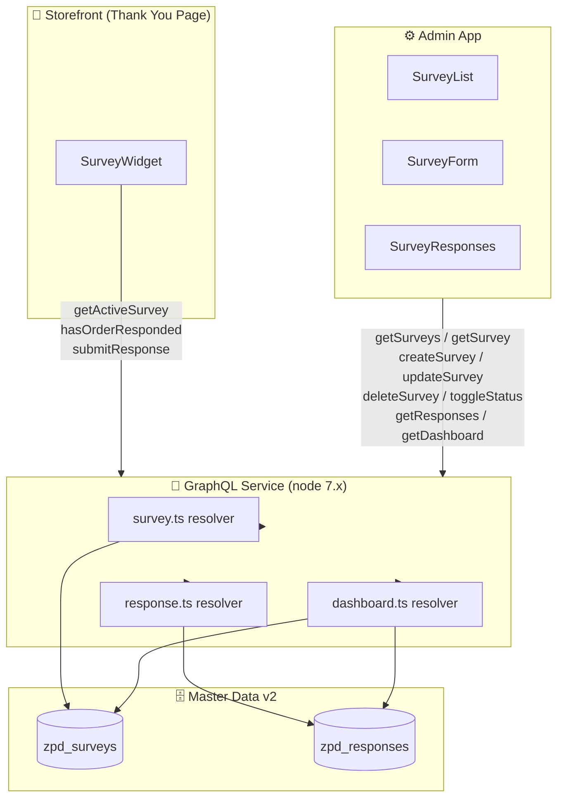
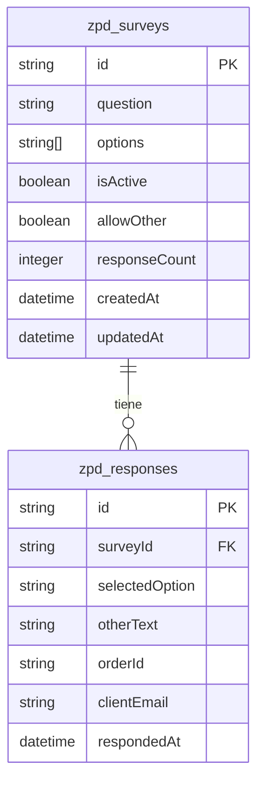
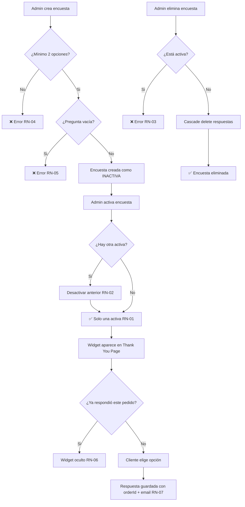
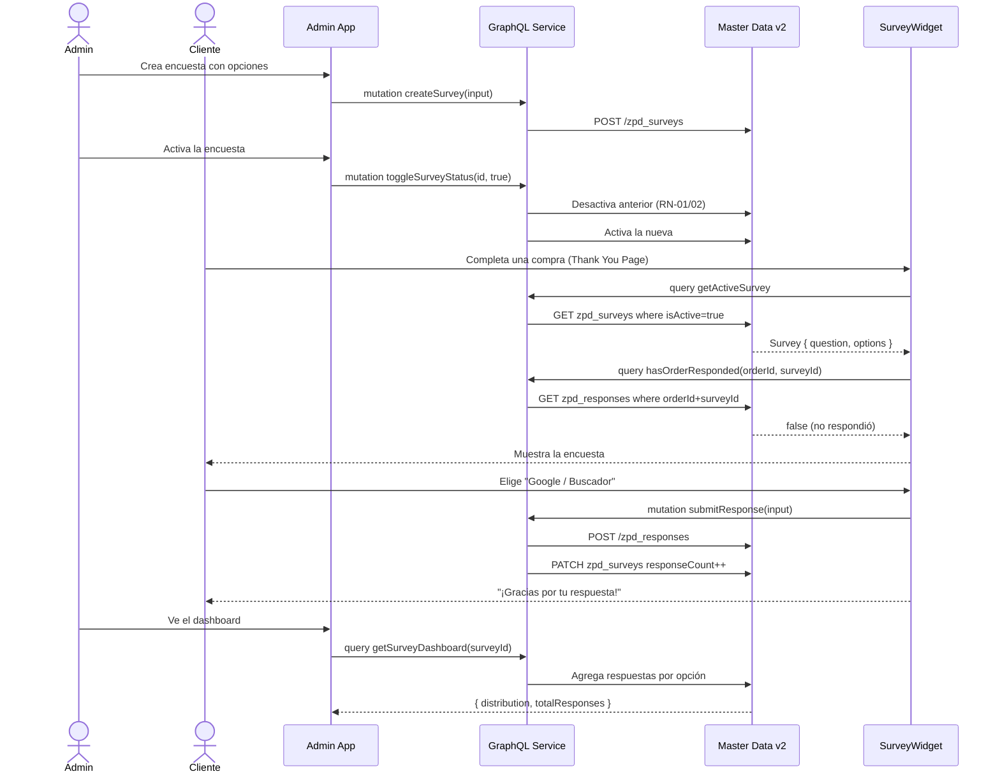
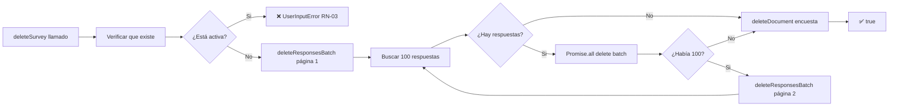

# Zero-Party Data Survey Manager

> VTEX IO Admin App para capturar Zero-Party Data mediante encuestas post-compra en la Thank You Page.

## Tabla de contenidos

- [Concepto](#concepto)
- [Arquitectura](#arquitectura)
- [Stack técnico](#stack-técnico)
- [Estructura del proyecto](#estructura-del-proyecto)
- [Master Data v2](#master-data-v2)
- [GraphQL API](#graphql-api)
- [Reglas de negocio](#reglas-de-negocio)
- [Pantallas](#pantallas)
- [Flujo de datos](#flujo-de-datos)
- [Instalación y desarrollo](#instalación-y-desarrollo)
- [Integración con Store Theme](#integración-con-store-theme)

---

## Concepto

### ¿Qué es Zero-Party Data?

**Zero-Party Data (ZPD)** son datos que el cliente proporciona voluntariamente y de forma intencional. A diferencia de los datos de terceros (cookies) o datos inferidos por analytics, el ZPD tiene la mayor confiabilidad posible: el cliente lo dice directamente.

### El problema: Dark Funnel

Herramientas como GA4 o Meta Pixel no pueden medir ciertos canales de adquisición:

| Canal | ¿GA4 lo mide? |
|-------|---------------|
| Google Ads / Meta Ads | ✅ Con pixel |
| Email marketing | ✅ Con UTMs |
| Boca a boca | ❌ |
| Podcasts / radio | ❌ |
| TikTok orgánico | ❌ |
| Recomendación de amigo | ❌ |

Estos canales invisibles forman el **Dark Funnel**. Esta app los captura preguntándole directamente al cliente en el momento de mayor satisfacción: después de completar una compra.

```
Cliente compra → Thank You Page → "¿Cómo nos conociste?" → Respuesta → Dashboard Admin
```

---

## Arquitectura



---

## Stack técnico

| Capa | Tecnología | Versión |
|------|-----------|---------|
| Plataforma | VTEX IO | — |
| Lenguaje | TypeScript | strict |
| Backend | node builder | 7.x |
| API | graphql builder | 2.x |
| Frontend Admin | react builder + admin builder | 3.x / 0.x |
| Frontend Store | store builder | 0.x |
| UI | VTEX Styleguide | 9.x |
| Apollo Client | react-apollo (provisto por VTEX IO) | — |
| Base de datos | Master Data v2 | — |
| i18n | messages builder | 1.x |

---

## Estructura del proyecto

```
admin-example/
├── manifest.json                        # Config VTEX IO: vendor, builders, policies
├── graphql/
│   ├── schema.graphql                   # Queries y Mutations principales
│   └── types/
│       ├── Survey.graphql               # Type Survey
│       ├── SurveyInput.graphql          # Input para create/update
│       ├── Response.graphql             # Types SurveyResponse + ResponseList
│       ├── ResponseInput.graphql        # Input para submitResponse
│       └── Dashboard.graphql            # Types OptionCount + SurveyDashboard
├── node/
│   ├── index.ts                         # Entry point, registra resolvers
│   ├── clients/index.ts                 # IOClients
│   ├── resolvers/
│   │   ├── survey.ts                    # CRUD encuestas + toggle + cascade delete
│   │   ├── response.ts                  # Submit + list respuestas
│   │   └── dashboard.ts                 # Agregaciones para el dashboard
│   └── utils/constants.ts               # DATA_ENTITY_*, SCHEMA_*, FIELDS
├── react/
│   ├── types/index.ts                   # Interfaces TypeScript
│   ├── graphql/                         # Operaciones GraphQL (11 archivos)
│   │   ├── getSurveys.graphql
│   │   ├── getSurvey.graphql
│   │   ├── createSurvey.graphql
│   │   ├── updateSurvey.graphql
│   │   ├── deleteSurvey.graphql
│   │   ├── toggleSurveyStatus.graphql
│   │   ├── getResponses.graphql
│   │   ├── getSurveyDashboard.graphql
│   │   ├── getActiveSurvey.graphql
│   │   ├── hasOrderResponded.graphql
│   │   └── submitResponse.graphql
│   ├── Skeleton.tsx                     # Componentes skeleton con shimmer
│   ├── SurveyList.tsx                   # Vista principal: lista de encuestas
│   ├── SurveyForm.tsx                   # Crear / editar encuesta
│   ├── SurveyResponses.tsx              # Dashboard + tabla de respuestas
│   └── SurveyWidget.tsx                 # Widget para Thank You Page
├── admin/
│   ├── navigation.json                  # Ítem en menú lateral del Admin
│   └── routes.json                      # Rutas de la SPA Admin
├── store/
│   └── interfaces.json                  # Bloque para store theme
├── messages/
│   ├── en.json
│   ├── es.json
│   └── pt.json
└── scripts/
    └── register-md-schemas.sh           # Registra JSON Schemas en MD v2
```

---

## Master Data v2

### Entidades

#### `zpd_surveys` — Configuración de encuestas

| Campo | Tipo | Descripción |
|-------|------|-------------|
| `id` | string | ID generado por MD v2 |
| `question` | string | Texto de la pregunta (max 500 chars) |
| `options` | string[] | Opciones de respuesta (min 2, max 20) |
| `isActive` | boolean | Solo una encuesta puede estar activa |
| `allowOther` | boolean | Habilita campo de texto libre "Otro" |
| `responseCount` | integer | Contador desnormalizado para performance |
| `createdAt` | datetime | ISO 8601 |
| `updatedAt` | datetime | ISO 8601 |

**Índices:** `isActive`, `createdAt`

#### `zpd_responses` — Respuestas individuales

| Campo | Tipo | Descripción |
|-------|------|-------------|
| `id` | string | ID generado por MD v2 |
| `surveyId` | string | FK a `zpd_surveys` |
| `selectedOption` | string | Opción elegida por el cliente |
| `otherText` | string? | Texto libre (solo si `allowOther`) |
| `orderId` | string | ID del pedido VTEX |
| `clientEmail` | string | Email del cliente |
| `respondedAt` | datetime | ISO 8601 |

**Índices:** `surveyId`, `orderId`, `clientEmail`, `respondedAt`, `selectedOption`

### Diagrama ER



---

## GraphQL API

### Queries

| Query | Descripción | Usado en |
|-------|-------------|----------|
| `getSurveys` | Lista todas las encuestas | SurveyList |
| `getSurvey(id)` | Una encuesta por ID | SurveyForm (edición) |
| `getActiveSurvey` | Encuesta activa actual | SurveyWidget |
| `getResponses(surveyId, page, pageSize, dateFrom, dateTo)` | Respuestas paginadas con filtros | SurveyResponses |
| `getSurveyDashboard(surveyId)` | Distribución de respuestas por opción | SurveyResponses |
| `hasOrderResponded(orderId, surveyId)` | Verifica si el pedido ya respondió | SurveyWidget |

### Mutations

| Mutation | Descripción | Reglas |
|----------|-------------|--------|
| `createSurvey(input)` | Crea una encuesta | RN-04, RN-05 |
| `updateSurvey(id, input)` | Actualiza una encuesta | RN-04, RN-05 |
| `deleteSurvey(id)` | Elimina encuesta + cascade delete de respuestas | RN-03 |
| `toggleSurveyStatus(id, isActive)` | Activa/desactiva | RN-01, RN-02 |
| `submitResponse(input)` | Registra respuesta del cliente | RN-06, RN-07 |

### Schema

```graphql
type Survey {
  id: ID!
  question: String!
  options: [String!]!
  isActive: Boolean!
  allowOther: Boolean
  responseCount: Int
  createdAt: String!
  updatedAt: String!
}

type SurveyResponse {
  id: ID!
  surveyId: String!
  selectedOption: String!
  otherText: String
  orderId: String!
  clientEmail: String!
  respondedAt: String!
}

type SurveyDashboard {
  surveyId: ID!
  question: String!
  totalResponses: Int!
  distribution: [OptionCount!]!
}

type OptionCount {
  option: String!
  count: Int!
  percentage: Float!
}
```

---

## Reglas de negocio



| Regla | Descripción | Capa |
|-------|-------------|------|
| **RN-01** | Solo una encuesta activa a la vez | Backend + Frontend |
| **RN-02** | Al activar, la anterior se desactiva automáticamente | Backend |
| **RN-03** | No se puede eliminar una encuesta activa | Backend + Frontend |
| **RN-04** | Mínimo 2 opciones de respuesta | Backend + Frontend |
| **RN-05** | La pregunta es obligatoria y no puede estar vacía | Backend + Frontend |
| **RN-06** | Un cliente responde una sola vez por pedido | Backend + Frontend |
| **RN-07** | Toda respuesta queda asociada a `orderId` y `clientEmail` | Backend |

---

## Pantallas

### SurveyList — Lista de encuestas

```
┌──────────────────────────────────────────────────────┐
│  Encuestas ZPD                      [+ Nueva encuesta]│
│  ─────────────────────────────────────────────────── │
│  🔍 Buscar por nombre...                             │
│                                                      │
│  ┌────────────────────────────────────────────────┐  │
│  │ ¿Cómo conociste nuestra tienda?   [● ACTIVA]   │  │
│  │ 4 opciones • Permite "Otro"  •  12 respuestas  │  │
│  │ Creada: 15 feb 2026          [✏️][📊][🗑️][ ●] │  │
│  └────────────────────────────────────────────────┘  │
│  ┌────────────────────────────────────────────────┐  │
│  │ ¿Qué te motivó a comprar hoy?    [○ INACTIVA]  │  │
│  │ 3 opciones  •  5 respuestas                    │  │
│  │ Creada: 10 feb 2026          [✏️][📊][🗑️][ ○] │  │
│  └────────────────────────────────────────────────┘  │
└──────────────────────────────────────────────────────┘
```

### SurveyForm — Crear / Editar encuesta

```
┌──────────────────────────────────────────────────────┐
│  ← Nueva encuesta                                    │
│  ─────────────────────────────────────────────────── │
│  Pregunta *                                          │
│  ┌──────────────────────────────────────────────┐   │
│  │ ¿Cómo conociste nuestra tienda?              │   │
│  └──────────────────────────────────────────────┘   │
│                                                      │
│  Opciones de respuesta *                             │
│  ┌────────────────────────────┐ [✕]                 │
│  │ Google / Buscador          │                     │
│  └────────────────────────────┘                     │
│  ┌────────────────────────────┐ [✕]                 │
│  │ Instagram / Redes Sociales │                     │
│  └────────────────────────────┘                     │
│  ┌────────────────────────────┐ [✕]                 │
│  │ Recomendación de un amigo  │                     │
│  └────────────────────────────┘                     │
│  [+ Agregar opción]                                  │
│                                                      │
│  ☑ Permitir respuesta "Otro" (texto libre)           │
│                                                      │
│  [Cancelar]                    [Guardar encuesta]    │
└──────────────────────────────────────────────────────┘
```

### SurveyResponses — Dashboard

```
┌──────────────────────────────────────────────────────┐
│  ← ¿Cómo conociste nuestra tienda?                   │
│  ─────────────────────────────────────────────────── │
│  TOTAL RESPUESTAS                                    │
│  47                                                  │
│                                                      │
│  Distribución de respuestas                          │
│  Google/Buscador    ████████████░░░░  28 (59%)       │
│  Instagram          ██████░░░░░░░░░░  12 (25%)       │
│  Recomendación      ███░░░░░░░░░░░░░   7 (15%)       │
│                                                      │
│  Desde: [──────────]  Hasta: [──────────]            │
│  ─────────────────────────────────────────────────── │
│  Email              │ Opción      │ Pedido  │ Fecha  │
│  ─────────────────────────────────────────────────── │
│  user@mail.com      │ Google      │ 1234567 │ 15 feb │
│  other@mail.com     │ Instagram   │ 1234568 │ 14 feb │
│                          < 1 2 3 >                   │
└──────────────────────────────────────────────────────┘
```

### SurveyWidget — Thank You Page (Storefront)

```
┌──────────────────────────────────────────────────────┐
│  AYÚDANOS CON UNA PREGUNTA RÁPIDA 🙏                 │
│                                                      │
│  ¿Cómo conociste nuestra tienda?                     │
│                                                      │
│  [Google / Buscador]  [Instagram]  [Recomendación]   │
│  [Podcast / YouTube]  [Otro]                         │
└──────────────────────────────────────────────────────┘

         ↓ Al responder

┌──────────────────────────────────────────────────────┐
│                    ✅                                 │
│          ¡Gracias por tu respuesta!                  │
│        Nos ayuda a mejorar tu experiencia.           │
└──────────────────────────────────────────────────────┘
```

---

## Flujo de datos

### Flujo completo end-to-end



### Cascade delete al eliminar encuesta



---

## Instalación y desarrollo

### Requisitos

- VTEX CLI instalado (`npm i -g vtex`)
- Acceso al account `redcloverqa`
- Node.js 18+

### Setup inicial

```bash
# 1. Clonar el repositorio
git clone https://github.com/VenticinqueMauro/Zero-Party-Data-adminapp.git
cd Zero-Party-Data-adminapp

# 2. Instalar dependencias
yarn install

# 3. Login en VTEX
vtex login redcloverqa

# 4. Usar workspace de desarrollo
vtex use mi-workspace

# 5. Registrar schemas en Master Data v2 (solo la primera vez)
APP_KEY="vtexappkey-redcloverqa-XXXXX" \
APP_TOKEN="tu-token" \
bash scripts/register-md-schemas.sh

# 6. Linkear la app
vtex link
```

### Scripts disponibles

| Comando | Descripción |
|---------|-------------|
| `vtex link` | Desarrollo local con hot-reload |
| `vtex publish` | Publicar versión |
| `vtex deploy` | Deploy a producción |
| `yarn lint` | Lint del código |
| `bash scripts/register-md-schemas.sh` | Registrar schemas en MD v2 |

### Variables de entorno (script de schemas)

| Variable | Descripción |
|----------|-------------|
| `APP_KEY` | VTEX App Key con permisos de Master Data |
| `APP_TOKEN` | VTEX App Token correspondiente |

---

## Integración con Store Theme

Para que el widget aparezca en la Thank You Page, hay que modificar el store theme del account (`redcloverqa.store-theme` o similar). Este es un repositorio separado.

### Paso 1 — Agregar dependencia en `manifest.json` del store theme

```json
{
  "dependencies": {
    "redcloverqa.zpd-survey-manager": "0.x"
  }
}
```

### Paso 2 — Agregar el bloque al template `order-placed`

```jsonc
// store/blocks/order-placed.jsonc
{
  "order-placed": {
    "blocks": [
      "order-placed-header",
      "redcloverqa.zpd-survey-manager:survey-widget",
      "order-placed-items",
      "order-placed-footer"
    ]
  }
}
```

### Paso 3 — Linkear ambos repos en el mismo workspace

```bash
# Terminal 1
cd admin-example && vtex link

# Terminal 2
cd store-theme && vtex link
```

### Comportamiento del widget

El widget es **no intrusivo**: se oculta automáticamente si:

- No hay ninguna encuesta activa
- El pedido ya tiene una respuesta registrada (RN-06)
- No se puede obtener el `orderId` del contexto de orden

---

## Decisiones técnicas

| Decisión | Alternativa descartada | Razón |
|----------|----------------------|-------|
| `react-apollo` para hooks | `@apollo/client` v3 | Apollo Client es provisto por VTEX IO automáticamente |
| `useOrder()` de `vtex.order-placed` | Parsear URL query params | API oficial, tipada y confiable |
| Paginación server-side en respuestas | Client-side con `useMemo` | Escala correctamente para muchas respuestas (MD v2 limit: 100/request) |
| `responseCount` desnormalizado | Count en cada query | Performance: evita un query adicional por encuesta |
| Cascade delete recursivo | Loop con `while(true)` | Evita `no-constant-condition` + `no-await-in-loop` de ESLint |
| `Promise.all` para desactivar surveys | `for await` secuencial | Performance + cumple regla ESLint `no-await-in-loop` |
| `fetchPolicy: 'cache-and-network'` en lista | `cache-first` (default) | La lista siempre muestra datos frescos al montar |
| `fetchPolicy: 'network-only'` en edición | `cache-first` (default) | El form de edición siempre carga datos actualizados |
| `refetchQueries` en create/update | Invalidar caché manualmente | Patrón Apollo estándar para mantener la lista sincronizada |

---

## Limitaciones conocidas

| Limitación | Descripción | Workaround |
|-----------|-------------|------------|
| MD v2 search limit | Máximo 100 documentos por request | Scroll con paginación recursiva |
| Sin agregaciones nativas en MD v2 | No hay `GROUP BY` ni `COUNT BY` | Calculado en el resolver de dashboard |
| Auth directives | Todas las operaciones son `PUBLIC` | Para producción, cambiar Admin ops a `@auth(scope: ADMIN)` |
| Total count en `getResponses` | Retorna `responses.length` del batch, no el total real | Para paginación precisa se necesita un query de conteo separado |

---

*Zero-Party Data Survey Manager — Red Clover Challenge Febrero 2026*
